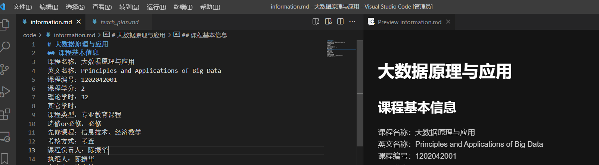

## 教学材料.exe

### 使用方法
下载后，修改information.md与teach_plan.md为对应课程信息，然后双击"教学材料.exe"运行即可。

### .md文件编辑方式
.md文件编辑软件很多，vscode,typora,都可以编辑，企业微信中也支持markdown。

### 注意
- 生成的文件仍然有一些小问题，且内容不完全，比如参考文献需要自己修改。
- 开源软件，任何人不能商用。
- 无法获取校园网（不能非法获取），因此只能采用半自动化方式生成。